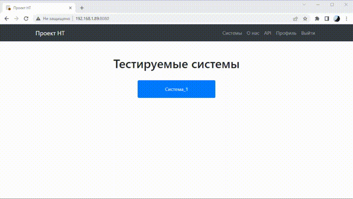
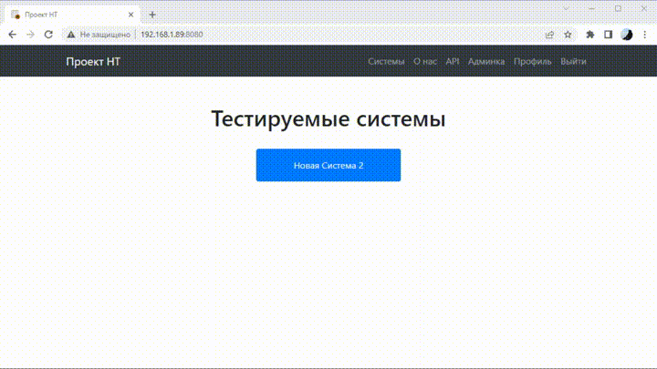

# Load Testing Hub
Service for storing, modifying and displaying load test runs and reports.  
[Cms-spring-boot](https://github.com/buttasam/cms-boot) was used as template.

## Architecture and Specs
It's MVC application wich uses:  
* Java 8 + Spring Boot + Spring Data JPA  
* PostgreSQL 14  
* Thymeleaf  
* JS + CSS libs    

## Quickstart
1) Clone repository
2) Create new DataBase with scheme from `other/sql/1.0-init.sql` and apply all patches
3) Update DataBase URL and server ip/port at `application.yml`
4) Go to project root folder `cd LoadTestingHub`
5) Build project `./gradlew build`
6) Run project `java -jar build/libs/cms-boot-1.0.jar`  
Or if you want it to run with selected profile  `java -jar build/libs/cms-boot-1.0.jar --spring.profiles.active=dev`
7) Service should be running on `192.168.1.89:8080` or other address from `application.yml`
8) Create user, add him necessary roles and start work


### Usage
As a `Viever` you can view runs and reports.  
  

As a `User` you can create runs and reports, view and edit them.  
  

As a `Developer` you can create systems and edit them.  
  

As a `Admin` you can give users roles and reset passwords.  
  

### Uploading test data
You can create run manually via gui or with this tools via cmd or Jenkins.  
1) [GrafanaDownloader](https://github.com/suhoy/GrafanaDownloader)
2) [InfluxExporterJson](https://github.com/suhoy/InfluxExporterJson)
3) [TestDataUploader](https://github.com/suhoy/TestUploader)
```shell
chcp 1251
@echo off

rem входные параметры
set "start_time=2022-01-12T20:55"
set "finish_time=2022-01-12T21:05"
set "times=2022-01-12T20:55:00 2022-01-12T21:00:00"
set "durations=00:05:00"
set "profiles=100 200"
set "report_name=Протокол"

rem формируем дату и время сборки
For /f "tokens=1-3 delims=/ " %%a in ('date /t') do (set mydate=%%c%%a%%b)
For /f "tokens=1-2 delims=/:" %%a in ("%TIME%") do (set mytime=%%a.%%b)

rem сохраняем графики
cd /d C:\example\grafana
java -jar GrafanaDownloader.jar -start %start_time% -finish %finish_time% -config config.txt -out out\%mydate%.%mytime%

rem статистика в json
cd /d C:\example\json
java -jar InfluxExporterJson-2.0.jar -config config.txt -out out\%mydate%.%mytime% -name stat.json -times %times% -durations %durations% -profiles %profiles%

rem загрузка теста
cd /d C:\example\uploader
java -jar TestUploader-1.0.jar -config config.txt -name %report_name% -time_start %start_time% -time_finish %finish_time% -graphs C:\example\grafana\out\%mydate%.%mytime% -attaches C:\example\json\out\%mydate%.%mytime% -stats C:\example\json\out\%mydate%.%mytime%
```

## IDE
IntelliJ IDEA recommended.

### Profile
Dev profile can be activated. In that case application-dev.yml is used. To do it in idea:  
`Run/Debug Configuration > Active Profiles > Insert "dev"`  
Be carefull of `initialization-mode` and `ddl-auto` !

### Lombok
[Lombok](https://projectlombok.org) is present and should be used in every entity as `@Data`. To run it smoothly in IDEA install Lombok plugin and 
turn on annotation processors in settings.
``
